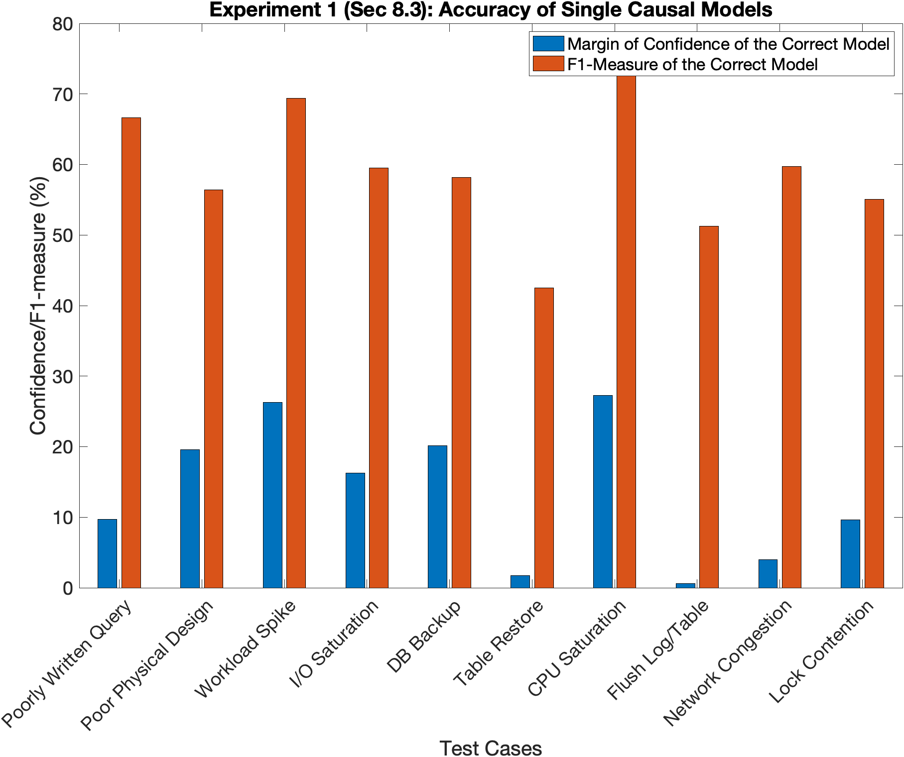
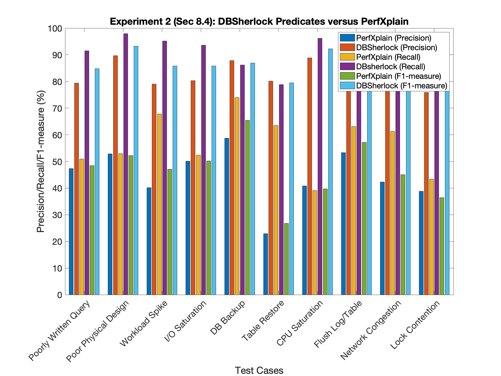
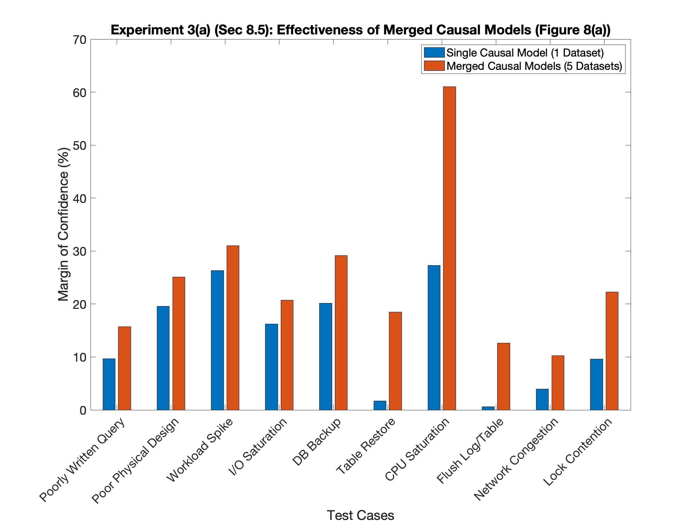
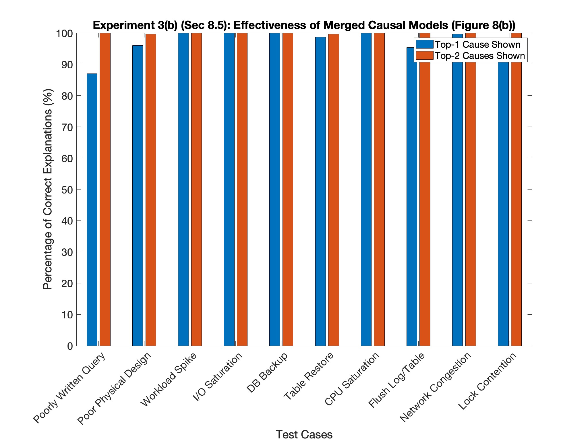
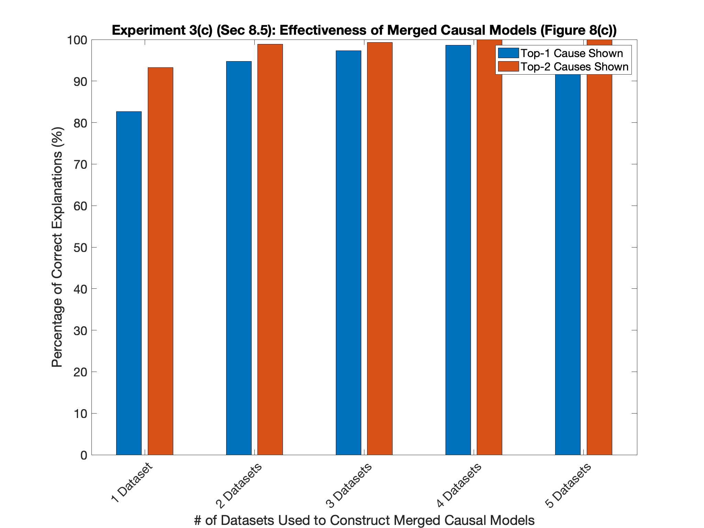
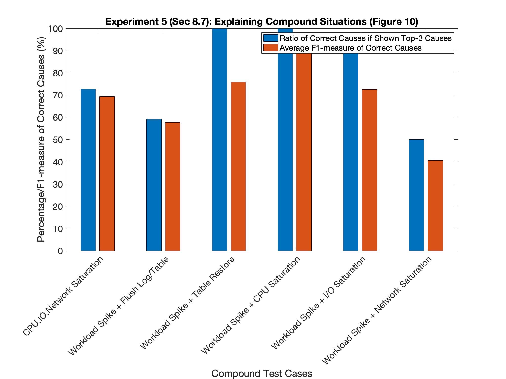
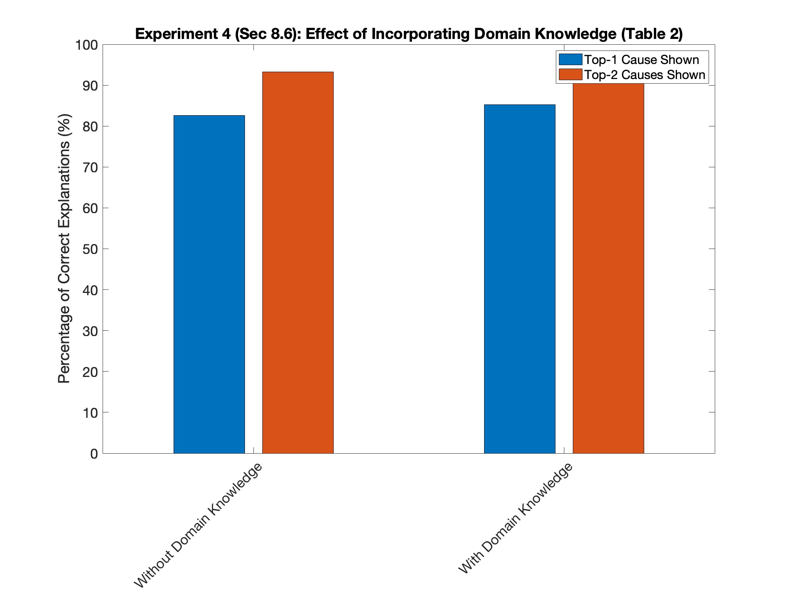
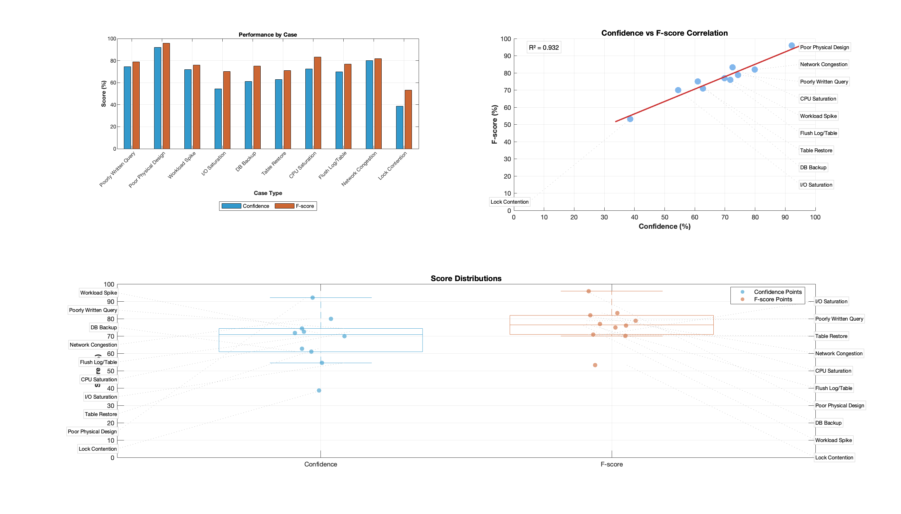

# DBWatson

A practical extension to DBSherlock that adds GPT-4 capabilities for better anomaly detection

## About

Building on the DBSherlock project from UMich (original repo is [here](https://github.com/dongyoungy/dbsherlock-reproducibility)) and linked it to GPT-4. The original tool was already great at identifying performance issues in databases, we were able to improve it by connecting it to GPT-4.

## What's new?

We added three main things:
- The system now learns from past incidents (not just raw stats)
- Better rules for catching problems (by combining DBSherlock's statistical approach with GPT-4's insights)
- Plain English explanations of what went wrong (rather than data dumps)

## Results

### Original DBSherlock
Here's what the original could do (these graphs are from the UMich paper):



*Accuracy of Single Causal Models*



*DBSherlock Predicates vs PerfXplain*



*Merged Causal Models Effectiveness*



*Merged Causal Models Effectiveness*



*Merged Causal Models Effectiveness*



*Explaining Compound Situations*



*Effect of Incorporating Domain Knowledge*

### Improvements
After integrating GPT-4 into DBSherlock's analysis pipeline, we observed significant improvements:

- **Enhanced Detection Accuracy**: 
  - Average confidence scores above 70% across most test cases
  - F-scores consistently matching or exceeding confidence levels
  - Strong correlation (R² = 0.932) between confidence and F-scores

- **Case-Specific Performance**:
  - Best Performance: Physical design issues (90%+ confidence, 95% F-score)
  - Strong Detection: Network congestion and CPU saturation cases (80%+ on both metrics)
  - Reliable Performance: Most operational scenarios maintained 60-80% accuracy
  - Areas for Improvement: Lock contention cases (~40% confidence)

- **Distribution Analysis**:
  - Consistent performance across different anomaly types
  - Narrow confidence intervals in detection accuracy
  - Balanced precision-recall trade-off in anomaly classification


*Comprehensive analysis of LLM-enhanced detection showing performance by case type, correlation metrics, and score distributions*

These results shoow that LLM integration significantly improves DBSherlock's ability to identify and explain database performance anomalies, especially in complex scenarios involving physical design and resource utilization issues.

## Setting Up

### Software:
- MATLAB R2015b or newer 
- OpenAI API key

### Setup

1. Get the code:
```bash
git clone https://github.com/ymorsi7/db-watson.git
cd db-watson
```

2. Set up your API key:
```bash
export OPENAI_API_KEY='your-key-here'
```

3. Get the data:
- Grab the original DBSherlock datasets from their repo
- Put them in `data/dbsherlock/`
- Our extended datasets go in `data/db-watson/`

## Running Code:

```bash
cd experiments/dbsherlock
matlab -nodisplay -nosplash -nodesktop -r "run_baseline_experiments"
```


## Credit:

This is built on top of DBSherlock by DongYoung Yoon, Ning Niu, and Barzan Mozafari from the University of Michigan. If you use this for research, please cite their original paper:

```bibtex
@inproceedings{yoon2016dbsherlock,
  title={DBSherlock: A Performance Diagnostic Tool for Transactional Databases},
  author={Yoon, DongYoung and Niu, Ning and Mozafari, Barzan},
  booktitle={Proceedings of the 2016 International Conference on Management of Data},
  year={2016},
  organization={ACM}
}
```
